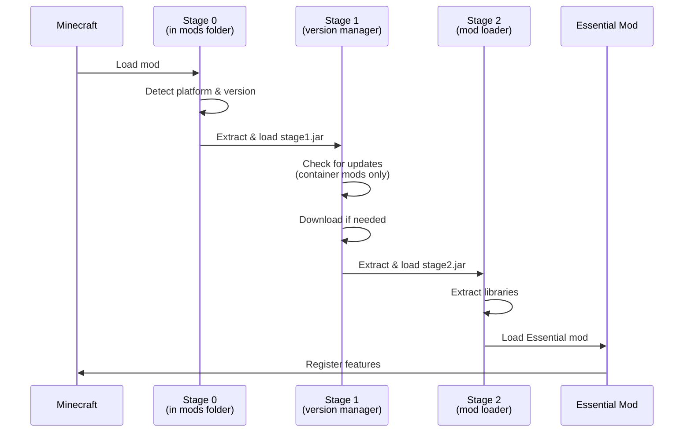
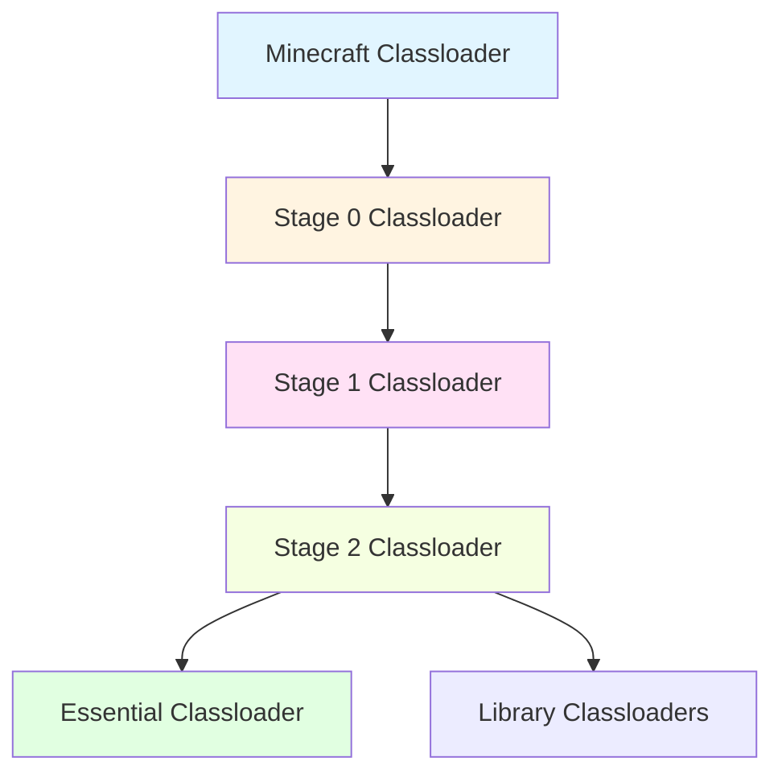

## Overview

Essential uses a **three-stage loader architecture** to enable seamless in-game updates, version management, and cross-platform compatibility without requiring users to manually update mod files.

<Info>
The loader is split into three stages, each with one JAR per platform. For platform details, see the [Platforms documentation](/concepts/platforms).
</Info>

## Why Three Stages?

A multi-stage loader solves several critical challenges:

<CardGroup cols={2}>
  <Card title="In-Game Updates" icon="download">
    Users receive updates automatically without replacing mod files.
  </Card>
  
  <Card title="Version Isolation" icon="box-archive">
    Different Minecraft versions can use different Essential versions without conflicts.
  </Card>
  
  <Card title="Classloader Separation" icon="layer-group">
    Prevents version conflicts and enables hot-swapping of code.
  </Card>
  
  <Card title="Minimal Footprint" icon="feather">
    Container mods are tiny (< 1MB) since they download the actual mod on demand.
  </Card>
</CardGroup>

## Stage 0: Initial Bootstrap

### Purpose

Stage 0 is the entry point that Minecraft's mod loader executes. It's embedded in both container mods and pinned JARs.

### Responsibilities

<Steps>
  <Step title="Detect environment">
    Identify the Minecraft version, mod loader type (Forge/Fabric/NeoForge), and platform variant.
  </Step>
  
  <Step title="Extract Stage 1">
    Extract the Stage 1 loader from either:
    - The container mod JAR (for container mods)
    - The bundled Essential JAR (for pinned mods)
  </Step>
  
  <Step title="Hand off control">
    Pass control to Stage 1 with environment information.
  </Step>
</Steps>

### File Location

```text Stage 0 files
loader/stage0/<platform>/build/libs/
├── loader-fabric.jar
├── loader-launchwrapper.jar
├── loader-modlauncher8.jar
└── loader-modlauncher9.jar
```

<Accordion title="Stage 0 code example">
```java Simplified Stage 0 entry point
@Mod("essential")
public class EssentialLoader {
    public EssentialLoader() {
        // Detect platform
        Platform platform = detectPlatform();
        
        // Extract stage1.jar to .minecraft/essential/loader/
        File stage1 = extractStage1(platform);
        
        // Load and invoke Stage 1
        ClassLoader stage1Loader = createIsolatedClassLoader(stage1);
        stage1Loader.loadClass("gg.essential.loader.stage1.EssentialLoader")
            .getMethod("load", Platform.class)
            .invoke(null, platform);
    }
}
```
</Accordion>

## Stage 1: Version Management

### Purpose

Stage 1 manages Essential versions and prepares the environment for loading the actual mod.

### Responsibilities

<Steps>
  <Step title="Version detection">
    Check what Essential version is currently installed in `.minecraft/essential/`.
  </Step>
  
  <Step title="Update check">
    For container mods, check Essential's servers for the latest version and download if needed.
  </Step>
  
  <Step title="Extract Stage 2">
    Extract Stage 2 from the Essential JAR for the current Minecraft version.
  </Step>
  
  <Step title="Load Stage 2">
    Create an isolated classloader and hand off control to Stage 2.
  </Step>
</Steps>

### File Location

```text Stage 1 files
.minecraft/essential/loader/
└── stage1.jar
```

<Note>
Stage 1 is extracted from whichever source has the most recent version (container mod or pinned JAR).
</Note>

### Update Flow

<Tabs>
  <Tab title="Container Mod">
    ```mermaid
    graph TD
      A[Stage 1 Starts] --> B{Check for updates}
      B -->|Update available| C[Download new Essential JAR]
      C --> D[Extract Stage 2]
      D --> E[Load Stage 2]
      B -->|No update| D
    ```
    
    Container mods always check for the latest Essential version on startup.
  </Tab>
  
  <Tab title="Pinned Mod">
    ```mermaid
    graph TD
      A[Stage 1 Starts] --> B[Use bundled Essential version]
      B --> C[Extract Stage 2]
      C --> D[Load Stage 2]
    ```
    
    Pinned mods use the Essential version they were built with.
  </Tab>
</Tabs>

### Version Isolation

Stage 1 ensures different Minecraft versions can use different Essential versions:

```text Essential version storage
.minecraft/essential/
├── Essential (fabric_1.20.4).jar
├── Essential (forge_1.12.2).jar
├── Essential (forge_1.16.5).jar
└── libraries/
    └── ...
```

Each file is specific to a Minecraft version and loader combination.

## Stage 2: Mod Loading

### Purpose

Stage 2 is the actual Essential Mod implementation. It loads dependencies and initializes Essential's features.

### Responsibilities

<Steps>
  <Step title="Extract libraries">
    Extract bundled dependencies from `META-INF/jars/` to `.minecraft/essential/libraries/`.
  </Step>
  
  <Step title="Set up classloader">
    Create a classloader with Essential and all dependencies.
  </Step>
  
  <Step title="Initialize Essential">
    Load and initialize the main Essential mod class.
  </Step>
  
  <Step title="Register features">
    Register commands, event handlers, GUI screens, and other features.
  </Step>
</Steps>

### File Location

```text Stage 2 files
loader/stage2/<platform>/build/libs/
├── stage2-fabric.jar
├── stage2-launchwrapper.jar
├── stage2-modlauncher8.jar
└── stage2-modlauncher9.jar
```

<Warning>
Stage 2 is not updated in lockstep with Essential releases. It may be older or newer than the Essential version, as long as they remain compatible.
</Warning>

### Library Management

Stage 2 handles Essential's dependencies:

```text Dependency structure
.minecraft/essential/
├── Essential (fabric_1.20.4).jar
│   └── META-INF/jars/
│       ├── library1.jar
│       ├── library2.jar
│       └── ...
└── libraries/
    ├── library1.jar  (extracted)
    ├── library2.jar  (extracted)
    └── ...
```

<Accordion title="Why extract libraries?">
Extracting libraries has several benefits:

- **Shared across versions**: Multiple Essential versions can share the same library files
- **Faster startup**: No need to extract every launch
- **Smaller downloads**: Updates only need to include changed libraries
- **Classloader flexibility**: Libraries can be loaded in specific classloaders as needed
</Accordion>

## Stage Interaction Diagram



## Container vs Pinned Mods

The loader stages enable two different distribution models:

<Tabs>
  <Tab title="Container Mod">
    ### Container Mod (essential.gg/download)
    
    A minimal JAR that downloads Essential on first launch.
    
    **Structure:**
    ```
    essential-fabric.jar (< 1MB)
    ├── Stage 0
    └── Stage 1
    ```
    
    **Behavior:**
    - Downloads latest Essential on first launch
    - Automatically updates to new versions
    - Minimal file size
    - Four variants (one per platform)
    
    **Use cases:**
    - Essential Installer
    - essential.gg/download
    - Mods that embed Essential Loader
  </Tab>
  
  <Tab title="Pinned Mod">
    ### Pinned Mod (Modrinth/CurseForge)
    
    A complete JAR with a specific Essential version.
    
    **Structure:**
    ```
    pinned_Essential (fabric_1.20.4).jar (60-80MB)
    ├── Stage 0
    ├── Stage 1  
    ├── Stage 2
    └── Essential Mod (specific version)
    ```
    
    **Behavior:**
    - Uses bundled Essential version
    - No automatic updates (unless user opts in)
    - Larger file size
    - One variant per Minecraft version + loader
    
    **Use cases:**
    - Modrinth distribution
    - CurseForge distribution
    - Users who want version control
  </Tab>
</Tabs>

## Classloader Hierarchy

Each stage uses an isolated classloader to prevent version conflicts:



<Info>
This isolation allows Stage 1 to be updated independently of Stage 2, and both can be updated without affecting the container mod in the mods folder.
</Info>

## File Locations Reference

<AccordionGroup>
  <Accordion title=".minecraft/mods/ folder">
    **Container mods (< 1MB):**
    - `essential-fabric.jar`
    - `essential-forge-1.12.2.jar`
    - `essential-forge-1.16.5.jar`
    - `essential-forge-1.20.4.jar`
    
    **Pinned mods (60-80MB):**
    - `pinned_Essential (fabric_1.20.4).jar`
    - `pinned_Essential (forge_1.12.2).jar`
  </Accordion>
  
  <Accordion title=".minecraft/essential/ folder">
    **Main Essential JARs:**
    - `Essential (fabric_1.20.4).jar`
    - `Essential (fabric_1.20.4).processed.jar` (temporary)
    - `Essential (forge_1.12.2).jar`
    
    **Extracted libraries:**
    - `libraries/*.jar`
  </Accordion>
  
  <Accordion title=".minecraft/essential/loader/ folder">
    **Stage files:**
    - `stage1.jar` (extracted from container/pinned mod)
    - `stage2.fabric_1.20.4.jar`
    - `stage2.fabric_1.20.4.jar.meta` (version info)
  </Accordion>
</AccordionGroup>

## Building the Loader

### Building All Stages

The loader is automatically built when building Essential:

```bash
./gradlew build
```

Loader JARs are found in `loader/<stage>/<platform>/build/libs/`.

### Building Specific Stages

```bash Building individual stages
# Build Stage 1 for all platforms
./gradlew :loader:stage1:build

# Build Stage 2 for Fabric
./gradlew :loader:stage2:fabric:build

# Build container mod for launchwrapper
./gradlew :loader:container:launchwrapper:build
```

<Note>
The loader is maintained in a separate Git submodule at `loader/`. Run `git submodule update --init --recursive` after cloning.
</Note>

## Verifying Loader Files

To verify the authenticity of loader files:

<Steps>
  <Step title="Identify the file type">
    Check if it's `stage1.jar`, `stage2.<loader>_<version>.jar`, or a container mod.
  </Step>
  
  <Step title="Build from source or download checksums">
    Either build the loader yourself or download checksums from GitHub Actions.
  </Step>
  
  <Step title="Compare checksums">
    Use `sha256sum` (Linux) or similar tools to verify file integrity.
  </Step>
</Steps>

<Tip>
See the [Verification guide](/building/verification) for detailed instructions on verifying all Essential files.
</Tip>

## Advanced Topics

<AccordionGroup>
  <Accordion title="Loader stage versioning">
    Each stage has its own version number:
    
    - **Stage 0**: Embedded in container/pinned mods, updated with Essential releases
    - **Stage 1**: Extracted from the latest source (container or pinned mod)
    - **Stage 2**: Has independent versioning, stored with `.meta` files
    
    The `.meta` file contains Stage 2's version:
    ```json .minecraft/essential/loader/stage2.fabric_1.20.4.jar.meta
    {
      "version": "1.2.3",
      "timestamp": 1234567890
    }
    ```
  </Accordion>
  
  <Accordion title="Processed JARs">
    Files ending in `.processed.jar` are temporary transformations of the main Essential JAR:
    
    - Created by Stage 2 for compatibility
    - Safe to delete (regenerated on next launch)
    - Contain the same code with minor modifications
  </Accordion>
  
  <Accordion title="Hot-swapping and updates">
    The multi-stage architecture theoretically allows hot-swapping Essential without restarting Minecraft:
    
    1. Stage 1 downloads a new Essential version
    2. Unloads the current Stage 2 classloader
    3. Extracts and loads the new Stage 2
    4. Re-initializes Essential features
    
    This is currently not implemented but the architecture supports it.
  </Accordion>
</AccordionGroup>

## Next Steps

<CardGroup cols={2}>
  <Card title="Platform Support" icon="puzzle-piece" href="/concepts/platforms">
    Learn about the four loader platforms Essential supports
  </Card>
  
  <Card title="Building Container" icon="box" href="/building/essential-container">
    Build Essential Container mods from source
  </Card>
  
  <Card title="Building Loader" icon="gears" href="/building/essential-loader">
    Build the Essential Loader stages
  </Card>
  
  <Card title="Architecture" icon="sitemap" href="/concepts/architecture">
    Return to the architecture overview
  </Card>
</CardGroup>