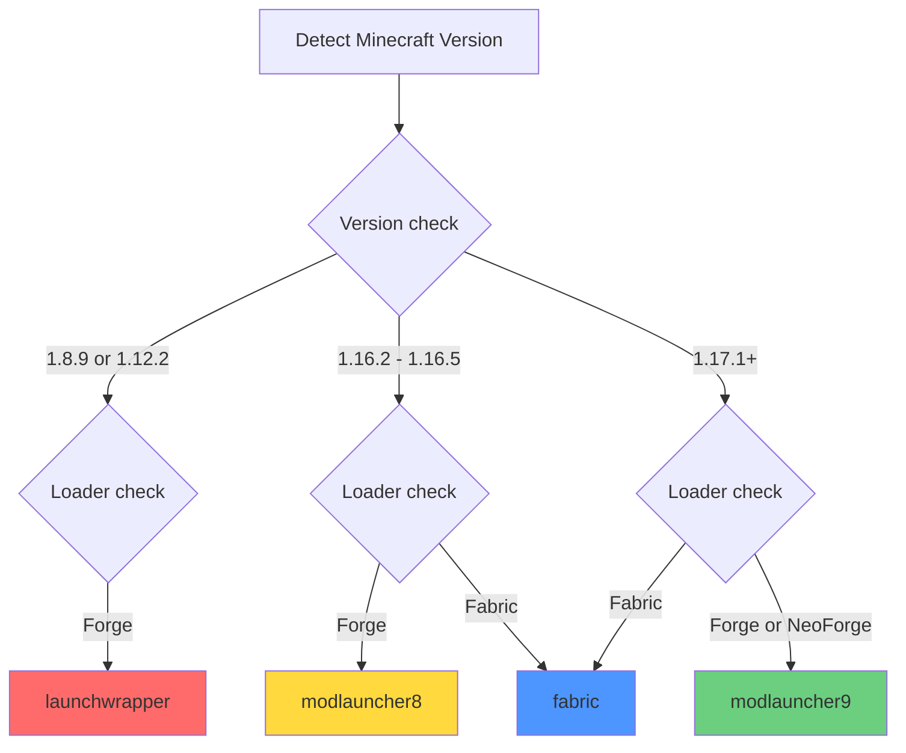

## Overview

Essential supports multiple mod loaders across different Minecraft versions. Instead of creating a separate codebase for each loader, Essential uses a **platform abstraction** system with four distinct platform variants.

<Info>
The four platforms are defined by the underlying mod loading technology, not just the mod loader name. This is why Forge has three different platforms.
</Info>

## The Four Platforms

Essential's loader is built for these four platforms:

<CardGroup cols={2}>
  <Card title="fabric" icon="wool-ball">
    **Fabric Loader**
    
    All Fabric versions from 1.16.2 to 1.21.x
  </Card>
  
  <Card title="launchwrapper" icon="cube">
    **Forge with LaunchWrapper**
    
    Minecraft 1.8.9 and 1.12.2
  </Card>
  
  <Card title="modlauncher8" icon="cubes">
    **Forge with ModLauncher 8**
    
    Minecraft 1.16.5
  </Card>
  
  <Card title="modlauncher9" icon="cubes-stacked">
    **Forge/NeoForge with ModLauncher 9+**
    
    Minecraft 1.17.1 and above
  </Card>
</CardGroup>

<Note>
These platforms correspond to different class loading and transformation systems, which is why they require separate loader implementations.
</Note>

## Platform Details

### Fabric

<Tabs>
  <Tab title="Overview">
    The Fabric platform is the simplest and most consistent across versions.
    
    **Characteristics:**
    - Lightweight mod loader
    - Consistent API across versions
    - Uses Fabric Loader's mod discovery
    - Supports mixins out of the box
    
    **Supported versions:**
    ```
    1.16.2, 1.16.5 (via alias)
    1.17.1, 1.18.1, 1.18.2
    1.19, 1.19.2, 1.19.3, 1.19.4
    1.20, 1.20.1, 1.20.2, 1.20.4, 1.20.6
    1.21.1, 1.21.3, 1.21.4, 1.21.5, 1.21.6, 1.21.7, 1.21.9, 1.21.11
    ```
  </Tab>
  
  <Tab title="Implementation">
    ```json fabric.mod.json
    {
      "schemaVersion": 1,
      "id": "essential",
      "version": "${version}",
      "name": "Essential",
      "entrypoints": {
        "preLaunch": [
          "gg.essential.loader.stage0.EssentialSetupTweaker"
        ]
      },
      "mixins": [
        "mixins.essential.json"
      ]
    }
    ```
    
    Essential registers a `preLaunch` entrypoint that runs before Minecraft starts.
  </Tab>
  
  <Tab title="Container mod">
    ```bash Building Fabric container
    ./gradlew :loader:container:fabric:build
    ```
    
    **Output:**
    ```
    loader/container/fabric/build/libs/
    └── essential-fabric.jar  (< 1MB)
    ```
    
    This single JAR works with all Fabric Minecraft versions.
  </Tab>
</Tabs>

### LaunchWrapper

<Tabs>
  <Tab title="Overview">
    The original Forge mod loading system used in legacy Minecraft versions.
    
    **Characteristics:**
    - Uses Java agents for class transformation
    - Tweaker-based mod loading
    - Legacy LWJGL2 support
    - Direct bytecode manipulation
    
    **Supported versions:**
    ```
    1.8.9-forge
    1.12.2-forge
    ```
  </Tab>
  
  <Tab title="Implementation">
    ```java EssentialTweaker.java
    @Mod(modid = "essential")
    public class EssentialTweaker implements ITweaker {
        @Override
        public void acceptOptions(List<String> args, File gameDir, 
                                   File assetsDir, String profile) {
            // Initialize Essential loader
        }
        
        @Override
        public void injectIntoClassLoader(LaunchClassLoader classLoader) {
            // Register transformers
            classLoader.registerTransformer(
                "gg.essential.asm.EssentialTransformer"
            );
        }
        
        @Override
        public String getLaunchTarget() {
            return "net.minecraft.client.main.Main";
        }
    }
    ```
  </Tab>
  
  <Tab title="Container mod">
    ```bash Building LaunchWrapper container
    ./gradlew :loader:container:launchwrapper:build
    ```
    
    **Output:**
    ```
    loader/container/launchwrapper/build/libs/
    └── essential-launchwrapper.jar  (< 1MB)
    ```
    
    Works with both 1.8.9 and 1.12.2 Forge.
  </Tab>
</Tabs>

### ModLauncher 8

<Tabs>
  <Tab title="Overview">
    Forge's first-generation ModLauncher system, used exclusively in Minecraft 1.16.5.
    
    **Characteristics:**
    - Service-based architecture
    - Improved class transformation pipeline
    - Better Java 9+ compatibility
    - ModLauncher API version 8.x
    
    **Supported versions:**
    ```
    1.16.5-forge (1.16.2 uses an alias)
    ```
  </Tab>
  
  <Tab title="Implementation">
    ```java mods.toml
    modLoader = "javafml"
    loaderVersion = "[36,)"
    license = "Essential"
    
    [[mods]]
    modId = "essential"
    version = "${version}"
    displayName = "Essential"
    description = "Essential Mod"
    ```
    
    Essential registers as a standard Forge mod with ModLauncher 8 services.
  </Tab>
  
  <Tab title="Container mod">
    ```bash Building ModLauncher 8 container
    ./gradlew :loader:container:modlauncher8:build
    ```
    
    **Output:**
    ```
    loader/container/modlauncher8/build/libs/
    └── essential-modlauncher8.jar  (< 1MB)
    ```
    
    Only works with Minecraft 1.16.5 Forge.
  </Tab>
</Tabs>

### ModLauncher 9+

<Tabs>
  <Tab title="Overview">
    The modern Forge/NeoForge loading system used in Minecraft 1.17.1 and above.
    
    **Characteristics:**
    - Enhanced service layer
    - Improved performance
    - Java 16+ support
    - Compatible with NeoForge (1.20.4+)
    - ModLauncher API version 9.x and 10.x
    
    **Supported versions:**
    ```
    Forge:    1.17.1, 1.18.2, 1.19.2, 1.19.3, 1.19.4,
              1.20.1, 1.20.2, 1.20.4, 1.20.6, 
              1.21.1, 1.21.3, 1.21.4, 1.21.5, 1.21.7
    
    NeoForge: 1.20.4, 1.20.6,
              1.21.1, 1.21.3, 1.21.4, 1.21.5, 1.21.7
    ```
  </Tab>
  
  <Tab title="Implementation">
    ```java mods.toml
    modLoader = "javafml"
    loaderVersion = "[40,)"
    license = "Essential"
    
    [[mods]]
    modId = "essential"
    version = "${version}"
    displayName = "Essential"
    ```
    
    Similar to ModLauncher 8 but with updated version requirements.
  </Tab>
  
  <Tab title="Container mod">
    ```bash Building ModLauncher 9 container
    ./gradlew :loader:container:modlauncher9:build
    ```
    
    **Output:**
    ```
    loader/container/modlauncher9/build/libs/
    └── essential-modlauncher9.jar  (< 1MB)
    ```
    
    Works with all modern Forge and NeoForge versions (1.17.1+).
  </Tab>
</Tabs>

## Platform Selection

How Essential determines which platform to use:



<Accordion title="Platform detection code">
```java Simplified platform detection
public enum Platform {
    FABRIC,
    LAUNCHWRAPPER,
    MODLAUNCHER8,
    MODLAUNCHER9;
    
    public static Platform detect() {
        String mcVersion = getMinecraftVersion();
        
        // Check if Fabric is present
        if (classExists("net.fabricmc.loader.api.FabricLoader")) {
            return FABRIC;
        }
        
        // Forge version detection
        if (mcVersion.equals("1.8.9") || mcVersion.equals("1.12.2")) {
            return LAUNCHWRAPPER;
        } else if (mcVersion.equals("1.16.5")) {
            return MODLAUNCHER8;
        } else {
            return MODLAUNCHER9;
        }
    }
}
```
</Accordion>

## Container Mod Variants

Essential provides four container mod variants, one per platform:

<Tabs>
  <Tab title="Distribution">
    | File | Platform | Minecraft Versions |
    |------|----------|--------------------|
    | `essential-fabric.jar` | Fabric | 1.16.2 - 1.21.x |
    | `essential-launchwrapper.jar` | Forge | 1.8.9, 1.12.2 |
    | `essential-modlauncher8.jar` | Forge | 1.16.5 |
    | `essential-modlauncher9.jar` | Forge/NeoForge | 1.17.1 - 1.21.x |
    
    Each variant is less than 1MB and contains only the Stage 0 and Stage 1 loaders.
  </Tab>
  
  <Tab title="Download locations">
    **essential.gg/download:**
    - Automatically selects the correct variant based on your Minecraft version
    
    **Essential Installer:**
    - Detects your Minecraft version and installs the appropriate container
    
    **Manual download:**
    - Build from source: `./gradlew :loader:container:<platform>:build`
    - Found in `loader/container/<platform>/build/libs/`
  </Tab>
</Tabs>

## Pinned Mod Variants

Pinned mods (Modrinth/CurseForge) include the full Essential Mod:

```text Pinned mod naming
pinned_Essential (fabric_1.20.4).jar
pinned_Essential (forge_1.12.2).jar
pinned_Essential (neoforge_1.21.1).jar
```

Each pinned mod includes:
- Stage 0 loader (platform-specific)
- Stage 1 loader
- Stage 2 loader (platform-specific)
- Full Essential Mod (version-specific)

<Warning>
Pinned mods are 60-80MB each, compared to container mods which are under 1MB.
</Warning>

## Platform-Specific Code

While most of Essential's code is shared, some platform-specific implementations exist:

### Loader Stages

```text Loader structure
loader/
├── stage0/
│   ├── fabric/
│   ├── launchwrapper/
│   ├── modlauncher8/
│   └── modlauncher9/
├── stage1/          # Shared across platforms
└── stage2/
    ├── fabric/
    ├── launchwrapper/
    ├── modlauncher8/
    └── modlauncher9/
```

Stage 0 and Stage 2 are platform-specific, while Stage 1 is shared.

### Mixins

Some mixins are loader-specific:

```java Fabric-specific mixin
// Only compiled for Fabric builds
@Mixin(value = MinecraftClient.class, remap = false)
public class Mixin_FabricSpecific {
    // Fabric-only logic
}
```

```java Forge-specific mixin
// Only compiled for Forge builds  
@Mixin(Minecraft.class)
public class Mixin_ForgeSpecific {
    // Forge-only logic
}
```

## NeoForge Support

Starting with Minecraft 1.20.4, Essential supports NeoForge:

<Steps>
  <Step title="NeoForge introduction">
    NeoForge is a fork of Forge that continues development independently. It uses the same ModLauncher 9+ infrastructure.
  </Step>
  
  <Step title="Platform compatibility">
    NeoForge uses the `modlauncher9` platform, making it compatible with modern Forge builds.
  </Step>
  
  <Step title="Supported versions">
    NeoForge support starts at 1.20.4 and continues through all newer versions (1.20.6, 1.21.x).
  </Step>
</Steps>

<Info>
From Essential's perspective, NeoForge is treated as a variant of Forge using ModLauncher 9+. No separate platform is needed.
</Info>

## Cross-Platform Features

Despite platform differences, Essential provides consistent features across all loaders:

<CardGroup cols={2}>
  <Card title="Cosmetics" icon="shirt">
    All cosmetics work identically on Fabric, Forge, and NeoForge.
  </Card>
  
  <Card title="Social Features" icon="users">
    Friends, messaging, and parties function the same on all platforms.
  </Card>
  
  <Card title="Screenshots" icon="camera">
    Screenshot manager and sharing work across all loaders.
  </Card>
  
  <Card title="Settings" icon="gear">
    Identical settings UI and configuration on all platforms.
  </Card>
</CardGroup>

## Platform Abstraction Layer

Essential uses a platform abstraction to handle loader-specific logic:

<Accordion title="Platform abstraction example">
```java Platform interface
public interface Platform {
    /** Get the current Minecraft version */
    String getMinecraftVersion();
    
    /** Get the mod loader name */
    String getLoaderName();
    
    /** Check if a mod is loaded */
    boolean isModLoaded(String modId);
    
    /** Get mod container for a mod */
    Optional<ModContainer> getModContainer(String modId);
}
```

```java Fabric implementation
public class FabricPlatform implements Platform {
    @Override
    public boolean isModLoaded(String modId) {
        return FabricLoader.getInstance()
            .isModLoaded(modId);
    }
}
```

```java Forge implementation  
public class ForgePlatform implements Platform {
    @Override
    public boolean isModLoaded(String modId) {
        return ModList.get()
            .isLoaded(modId);
    }
}
```
</Accordion>

## Building for Specific Platforms

### Build All Platforms

```bash
./gradlew build
```

Builds Essential for all platforms and versions.

### Build Specific Loaders

```bash Building specific platforms
# All Fabric versions
./gradlew :1.20.4-fabric:build

# Specific Forge version
./gradlew :1.12.2-forge:build

# NeoForge version
./gradlew :1.21.1-neoforge:build
```

### Build Container Mods

```bash Building container mods
# All container mods
./gradlew :loader:container:build

# Specific platform
./gradlew :loader:container:fabric:build
./gradlew :loader:container:modlauncher9:build
```

## Platform Compatibility Matrix

| Minecraft | Fabric | Forge | NeoForge | Platform |
|-----------|--------|-------|----------|----------|
| 1.8.9 | - | ✓ | - | launchwrapper |
| 1.12.2 | - | ✓ | - | launchwrapper |
| 1.16.2 | ✓ | ✓ | - | fabric / modlauncher8 |
| 1.17.1 | ✓ | ✓ | - | fabric / modlauncher9 |
| 1.18.x | ✓ | ✓ | - | fabric / modlauncher9 |
| 1.19.x | ✓ | ✓ | - | fabric / modlauncher9 |
| 1.20.1-1.20.2 | ✓ | ✓ | - | fabric / modlauncher9 |
| 1.20.4+ | ✓ | ✓ | ✓ | fabric / modlauncher9 |
| 1.21.x | ✓ | ✓ | ✓ | fabric / modlauncher9 |

<Note>
Fabric support starts at Minecraft 1.16.2. Earlier versions are Forge-only.
</Note>

## Next Steps

<CardGroup cols={2}>
  <Card title="Loader Stages" icon="stairs" href="/concepts/loader-stages">
    Learn how the three-stage loader works across platforms
  </Card>
  
  <Card title="Building Essential" icon="hammer" href="/building/essential-mod">
    Build Essential for different platforms
  </Card>
  
  <Card title="Multi-Version Support" icon="layer-group" href="/concepts/multi-version">
    Understand version compatibility
  </Card>
  
  <Card title="Architecture" icon="sitemap" href="/concepts/architecture">
    Return to the architecture overview
  </Card>
</CardGroup>