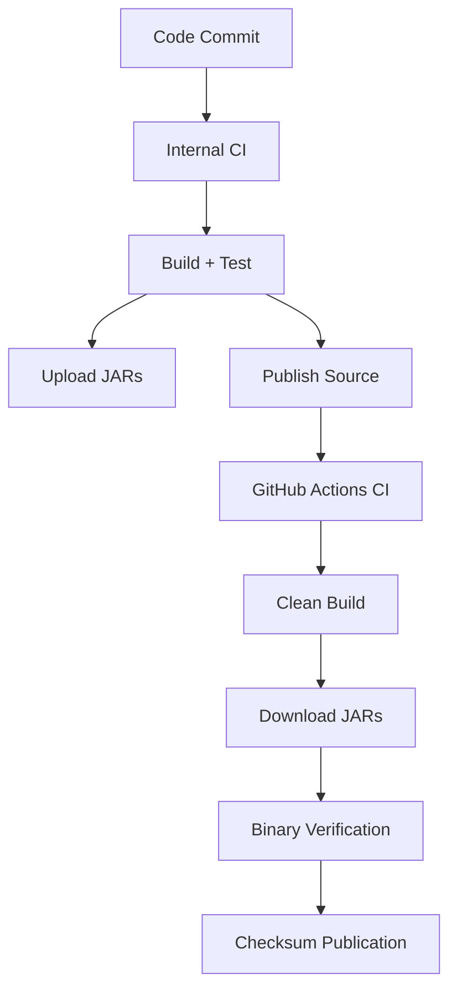

Essential uses a **dual-CI system** where every release is built twice to ensure the published source code matches the distributed binaries. This provides transparency and verification that users can trust.

## Dual-CI Architecture

Every Essential release goes through two independent build processes:

### 1. Internal CI (Primary Build)

The first build runs on Essential's internal, self-hosted CI system:

- **Faster build times** - Optimized infrastructure for quick builds
- **Integration tests** - Runs comprehensive test suites
- **Upload to infrastructure** - Uploads jars (but does not publish them yet)
- **Source code publishing** - Publishes the source code to the public GitHub repository

### 2. GitHub Actions CI (Verification Build)

The second build runs on a clean GitHub-provided runner directly from the public repository:

- **Clean environment** - Ensures no hidden dependencies or modifications
- **Public source code** - Builds entirely from publicly accessible code
- **Binary verification** - Downloads jars from infrastructure and verifies they are **bit-for-bit identical** to the ones built from public source
- **Checksum publication** - Logs and publishes checksums as GitHub artifacts
- **Third-party verification** - Enables independent verification without building the entire mod

<Info>
  The GitHub Actions build proves that the published source code **exactly matches** the distributed binaries, ensuring complete transparency.
</Info>

## What Gets Verified

### Main Jars (Fully Verified)

The main Essential jars are verified for bit-for-bit identity:

- Downloaded by the in-game update functionality
- Used by third-party mods that embed the Essential Loader
- Distributed via thin container mods on essential.gg/download
- Used by the Essential Installer

### Pinned Jars (Checksum Only)

The "pinned" jars available on Modrinth and CurseForge are not directly verified because:

- They are **deterministically derived** from the main jars
- Verifying the main jars is sufficient
- Internal CI doesn't upload these; they're regenerated on-demand
- Checksums are logged in the public GitHub Actions run

<Note>
  Third parties can compare pinned jar checksums to files on Modrinth/CurseForge at any time using the GitHub Actions logs.
</Note>

## Checksum Artifacts

GitHub Actions provides two ways to access checksums:

1. **Checksums artifact** - Text file with all checksums (available for limited time)
2. **Build logs** - "Generate checksums" section in the `build` job

<Warning>
  GitHub automatically deletes Actions logs and artifacts after some time. Download checksums if you need long-term verification records.
</Warning>

## Build Requirements

Both CI systems must meet the same requirements for reproducible builds:

- **JDK versions**: Java 21, 17, 16, and 8 installed
- **Default Java**: Java 21 (or newer)
- **Gradle**: Uses gradle-wrapper for version consistency
- **Git submodules**: Fully initialized and updated
- **Clean environment**: No local modifications or cached state

## Transparency Benefits

The dual-CI system provides:

1. **User trust** - Verifiable proof that binaries match source code
2. **Security** - No hidden code or backdoors possible
3. **Auditability** - Anyone can verify the build process
4. **Reproducibility** - Builds are deterministic and bit-for-bit identical
5. **Community confidence** - Open verification process

## CI Workflow Summary

## For Developers

If you're building Essential yourself:

- Use the **gradle-wrapper** scripts (`./gradlew` or `gradlew.bat`)
- Do NOT use a local Gradle installation
- Different Gradle versions may not produce identical output
- Follow the [Building guide](/building) for detailed instructions

<Tip>
  The dual-CI system ensures you can always verify that Essential's distributed binaries match the public source code, providing complete transparency.
</Tip>